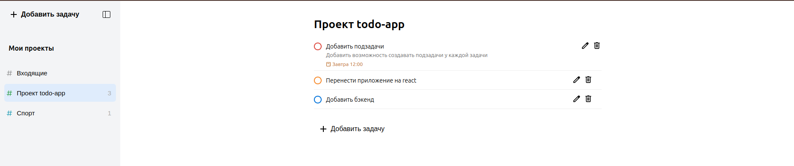

## [Демонстрация сайта](https://8gato8.github.io/todo-app/)

  

**Функционал:**

- Добавлять проекты и назначать в них задачи, задавать срок их исполнения

**Использованы следующие технологии:**

- Javascript (vanilla)
- HTML
- CSS
- Webpack

## Как запустить проект локально

`git clone git@github.com:8Gato8/todo-app.git` - клонировать репозиторий себе локально

`npm i` — установить пакеты

`npm run dev` — запустить сервер с hot-reload

## Ссылки

https://8gato8.github.io/todo-app/ - деплой проекта

## Статус проекта и планы по доработке

Завершён. Доработки не планируются.
